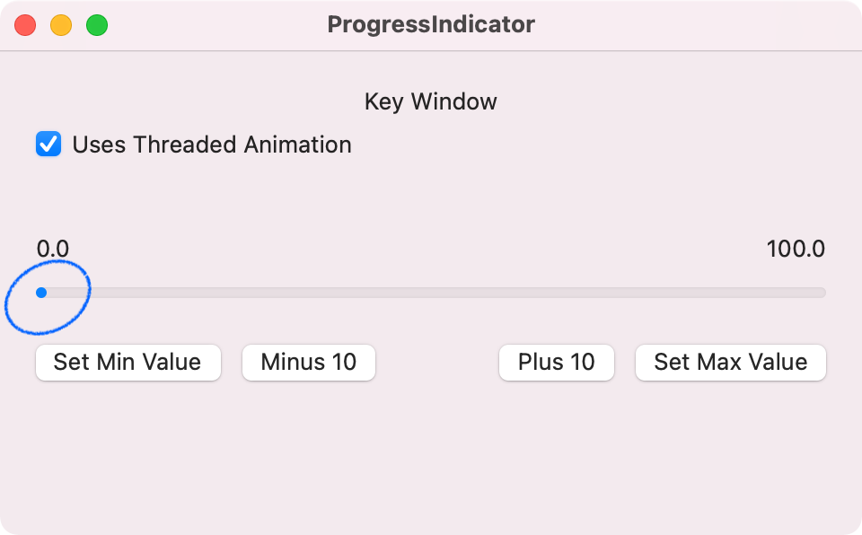
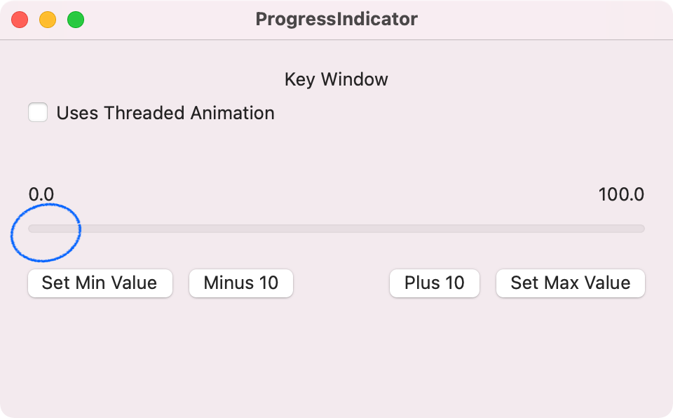
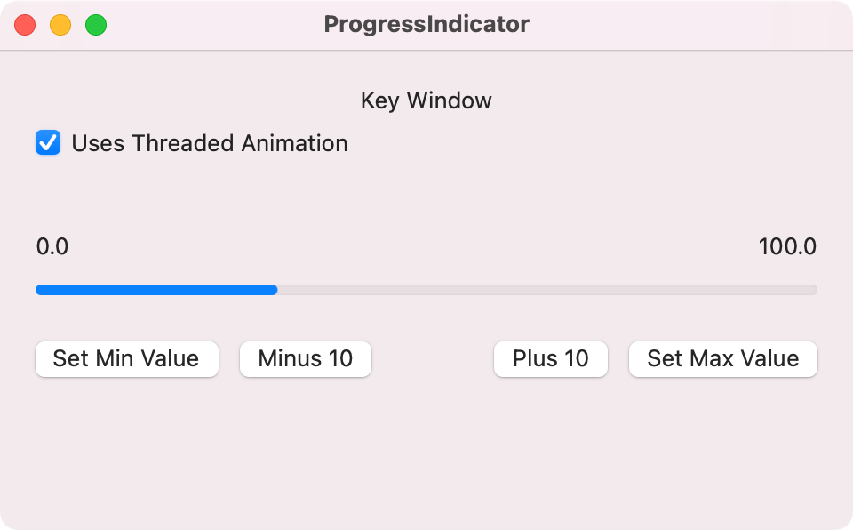
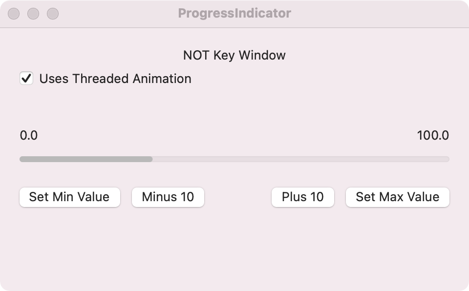
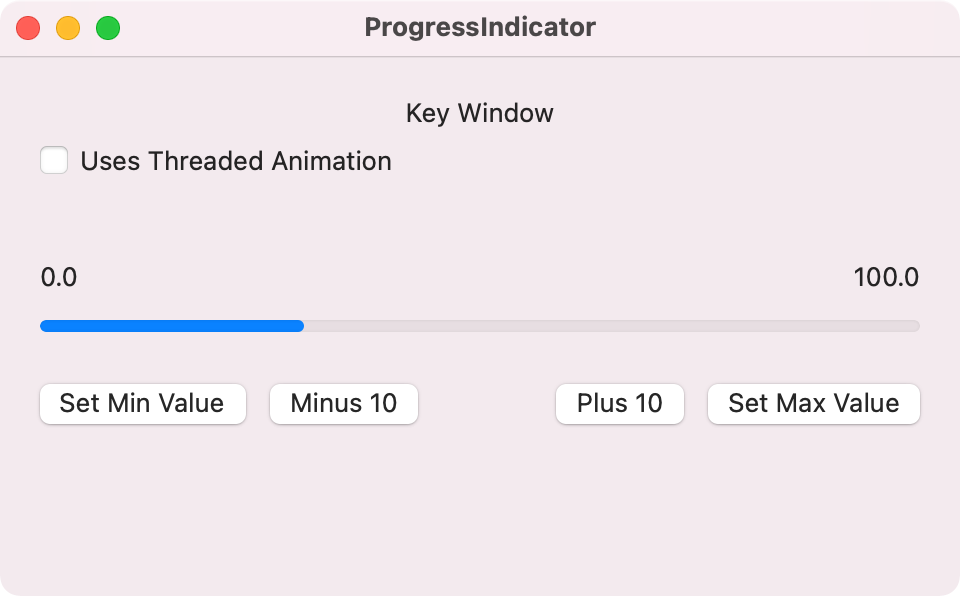
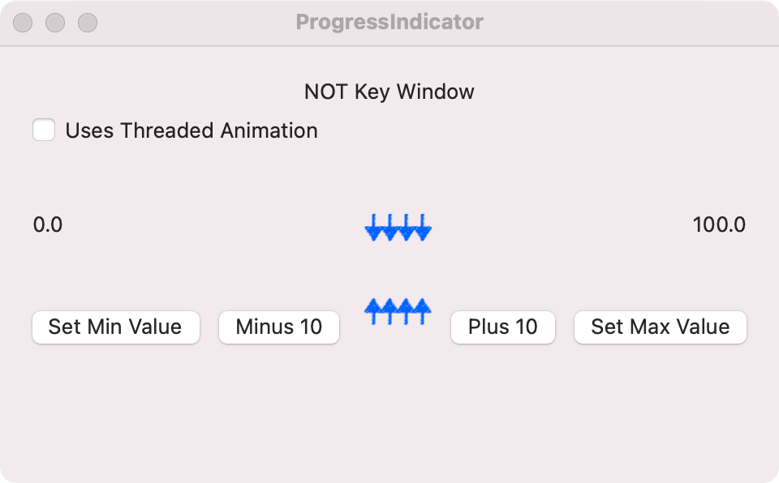

# feedback.apple.macOS-11.determinate-progress-bar-presentation

[Video](./screenshots/determinate-progress-indicator.mov)

## Issue 1: Progress bar can not display exactly min value when 'uses threaded animation' property value is true

## Issue 2: Progress bar become hidden when 'uses threaded animation' property value is false and window is NOT 'key window'

